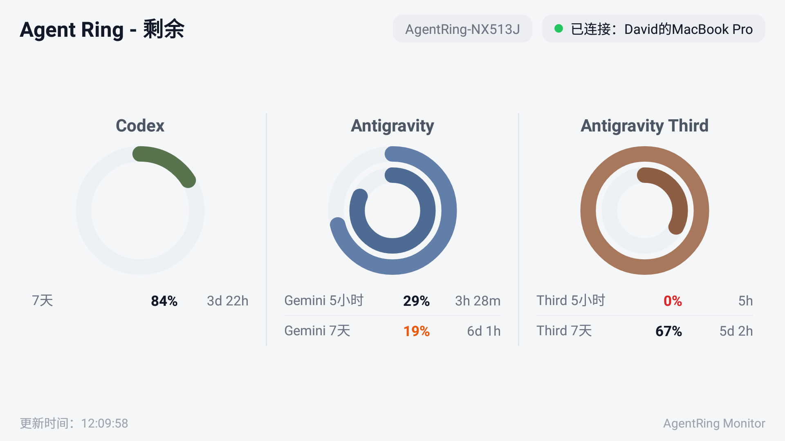

# AgentRing-Android 桌面副屏监视器

专为闲置旧手机（最低兼容 **Android 5.0.2 / API 21**）打造的桌面 AI 用量副屏应用。与电脑上的 [agentRing](https://github.com/haorui-lab/agentRing) 菜单栏应用通过**经典蓝牙 (Bluetooth SPP)** 通讯，将手机作为常亮副屏摆件，实时显示 Codex、Cursor、Antigravity 的**剩余额度**。



---

## 核心特性

- 📱 **老旧手机兼容**：最低支持 Android 5.0.2 (Lollipop, API 21)，流畅运行。
- 🔆 **屏幕常亮**：运行期间屏幕始终保持常亮，并开启全屏沉浸模式，充当专业桌面副屏。
- 🔵 **蓝牙自动命名**：手机启动后开启蓝牙并将名称自动设为 `AgentRing-XX`（XX 为手机型号或设备名），方便在 Mac 上一键配对。
- 🎯 **聚焦剩余额度**：只展示剩余百分比圆环、重置倒计时（Resets in Xh Ym）、剩余请求数与余额。
- 📐 **自适应仪表盘**：自适应电脑端配置了几个 Provider 就展示几个（1 个居中、2 个对称列、3 个及以上弹性网格/滚动），完美适配横屏桌面支架与竖屏模式。
- 🔄 **主动实时推送**：电脑端 `agentRing` 每次刷新用量时，主动通过蓝牙向副屏推送最新数据。

---

## 快速使用

### 1. 安装 APK 到 Android 手机
编译生成的 APK 位于：
`app/build/outputs/apk/debug/app-debug.apk`

使用 ADB 安装到手机：
```bash
adb install -r app/build/outputs/apk/debug/app-debug.apk
```

### 2. 启动应用与蓝牙配对
1. 在 Android 手机上打开 **AgentRing** 应用。
2. 手机会自动开启蓝牙，并在顶部显示设备名（如 `AgentRing-MI4`）与状态 `等待电脑通过蓝牙连接…`。
3. 打开 Mac **系统设置 -> 蓝牙**，在“附近的设备”中找到并点击 `AgentRing-XX` 进行**配对**。
4. 配对完成后，电脑上的 `AgentRing` 菜单栏应用在刷新数据时会自动与副屏建立连接，并主动推送额度数据！

---

## 独立测试工具

项目内提供了独立测试脚本 `tools/test_sender.py`，无需登录任何 AI 凭证即可模拟向手机副屏发送测试数据：

```bash
# 查看 1/2/3 个 Provider 模拟数据包
python3 tools/test_sender.py --providers 3 --dump-json

# 写入蓝牙串口设备循环推送
python3 tools/test_sender.py --providers 3 --device /dev/cu.AgentRing-xxx --loop --interval 5
```

---

## 从源码构建

**环境要求**：
- JDK 17+ (支持 Android Studio 捆绑 JDK)
- Android SDK 34 (API 21+)

```bash
cd agentRing-Android
./gradlew assembleDebug
```
编译产物位于 `app/build/outputs/apk/debug/app-debug.apk`。
